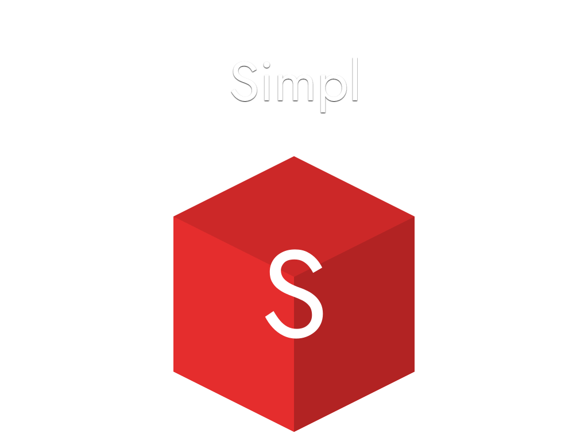

***

<div align="center">


</div>

<br>

## About Simpl:

***

#### Simpl is an easy-to-use PHP, HTML, CSS, SCSS and JavaScript framework!

- It works by using a view/part system seen in other frameworks but made smarter and easier to use!
- Comes included with Fontawesome icons, and support for SASS and JQuery
- I made Simpl as a quick setup template for myself and then decided to expand it and release it for other to use.
- Feel free to leave me any suggestions, ideas or complaints!

###### Credits for things used in Simpl listed below.

<br>

## Major Update History:

***

<br>

##### Version 1:

```
1.1 (26-Feb-2020)       -   Created the folder structure and the url loader.

1.2 (28-Feb-2020)       -   Fixed url loader not working in projects where the site is in a sub folder.
                        -   Created the form alert function.

1.3 (2-Mar-2020)        -   Created the mail controller for contact pages.

1.4 (6-Mar-2020)        -   Created the login and register pages.
                        -   Made a form stylesheet.

1.5 (9-Mar-2020)        -   Created a JQuery script for showing and hiding passwords.
                        -   Finished the form stylesheet and example login, register and contact pages.

1.6 (10-Mar-2020)       -   Created this nicer looking README file.
                        -   Created login functions.
                        -   Created register functions.
                        -   Added reCAPTCHA support.
                        -   Added a basic database sql file that will be needed for logging in and registering.
                        -   Fixed the password hide/show JQuery, now way shorter code.
```

<br>

##### Version 2:

```
2.1 (11-Nov-2020)       -   Complete redesign of the folder structure and Simpl in general.
                        -   Seperated basic files from extra's with a add-on folder and src.
```

###### _(Got busy with life so didn't make any commits in the time between releasing v2 and v3)_

<br>

##### Version 3:

```
3.1 (26-Apr-2021)       -   Fixed a lot of problems regarding the update to PHP version 8 (8.0.3)
                        -   Added a whole example page you can load up to see the main functions of Simpl 
                            in action and inspect them so you know how to use them in your own project!
                        -   Better way of sass compiling, now as a npm function in the package file!
                        -   Fixed some issues with the included JavaScript functions.
                        -   Made a pages stylesheet.
                        -   Created a piece of JavaScript to detect if Capslock is turned on when typing 
                            in a password input field. 
                        -   Added a @mixins and a @keyframes SCSS file.
                        -   Put the variables in their own vars file for SCSS.

3.1.2 (27-Apr-2021)     -   Fixed issues with the example page and removed redundant code.


3.2 (4-May-2021)        -   Update to PHP 8.0.5
                        -   Moved Database.php to add-ons
                        -   Added more JavaScript code pieces to use
                        
3.2.1 (6-May-2021)      -   Updated the SASS package to the latest version.
                        -   Fixed issues in the README file.
```

### **_Download latest version:_**

Site: <https://simpl.iwanvanderwal.nl/>

Clone: `git clone https://github.com/IJuanTM/Simpl`

***

<br>

## Index:

***

1. [About](#1-about)
2. [Quick Start](#2-quick-start)
3. [Pages](#3-pages)
4. [View](#4-view)
5. [Parts](#5-parts)
6. [Add-ons](#6-add-ons)
7. [Example](#7-example)

***

<br>

## 1. About

Simpl is a mini-cms framework made to give you a quick start to making your website!
It's easy to setup, use and learn by reading the comments made throughout the code. Follow this guide to learn the basics about using Simpl!

It uses the view/part system to load in the page, this is a common way to load parts and pages in your website. But Simpl expanded on this and added extra functions and made it very easy to add your own!

If you have ideas, suggestions or even a complaint, feel free to contact me via github.

<br>

## 2. Quick Start

#### To get you started:

- The src folder contains all the necessary files for your website. Just copy the
  `src` folder to a directory on your pc and rename the folder to your projects name.

- Then add this folder to your localhost sites on your system. I recommend using WAMP or XAMMP on windows or mac. But this will also work on Linux using Apache.

- I recommend using PhpStorm or Microsoft Visual Studio Code as IDE to work on your project.

- The main `index.php` file is only used to get the constants from the `config.php` file and run the `autoloader.php` file, which is used to get the Controllers and Models.

- In the Inc folder you find a file named `config.php`. Here you can define the name of your page (The one that shows at the tab in your browser), aswell as some other things, like quick constants to link to folders and so on.

- By default there is already a `home.phtml` in the view folder and a `HomePage.php` Class in the page folder. You can edit these to your liking.

- The style sheet that gets loaded is the `main.css` file in the css folder. This file gets generated via SASS using npm, so make sure to check out the `package.json` file on which packages to install using npm. When running `npm sass` npm will then take the `main.scss` in the scss folder and compile this to `main.css`.
  `main.scss` contains imports from the other scss files, so make sure to import newly added files when you do so.

- The main HTML files are located in the parts/view folder named `header.ptml` and `bottom.phtml` these load the needed files. To add or change meta tags or script parts check out the index folder located there as well.

- Read more below about the working and usecase of these folder and files.

<br>

## 3. Pages

#### How pages work:

- For every new page on your site you need to create a new php Class with the name of your page which you added in the view folder, for example: login.phtml. You want to name the Class in the page folder: LoginPage.php and make sure this is a .php class, can be empty.

- In each page Class you want to add any PHP code that has to be run on that perticular page.

- Thats it! Just make sure that you add one of these ...Page.php pages for every page you added in the view folder. If you get 404 errors when trying to get to a page this is one of the first things to check!

<br>

## 4. View

#### How view works:

- In the view folder is where you want to create every page you want on your site, for example: `login.phtml` and `cart.phtml`. In these files you of course want to type your HTML code as well as PHP where necessary.

- I recommend making a .scss file for every page you make in the view folder to increase code visibility and make it easier to change things later. But this is not mandatory for it to function. Just make sure to add each of these files to the `main.scss` imports.

- Thats it for adding pages to your site in the view folder. Very easy and very quick.

<br>

## 5. Parts

#### How parts work:

- A part is an component on a certain page, for example the navbar or footer. The content is where the pages from the view folder get loaded. In the parts folder you also will find the header and bottom part, these combined are the main html file. There also is a folder called index, here are 3 files: css, js and meta. These contain the code to load your css and js files and
  the optional meta tags.

- Thats the basics for the parts. The parts folder is also used for making sub pages on your site, you can find example files in the add-ons folder on GitHub.

<br>

## 6. Add-ons

#### What to find in add-ons:

- Example files for basic functions like: login pages, registration pages and mailing systems.

- Explanations on making subpages.

- Some handy JavaScript functions I wrote for things like a show/hide password eye or extendable nav menu.

- More to come!

<br>

## 7. Example

#### What example is:

- This is an example site using all of the included functions in Simpl.

- Copy and paste this folder into your localhost folder or unzip the Simpl zip file and add your own localhost and direct it to this folder to use it!

<br>

##### _Thats all! For more help don't be afraid asking questions on the GitHub page._

#### **Enjoy using Simpl and happy coding!**

<br>

***

### **_Download:_**

Site: <https://simpl.iwanvanderwal.nl/>

Clone: `git clone https://github.com/IJuanTM/Simpl`

***

<br>

## Credits:

***

- [Fontawesome](https://fontawesome.com/)
- [SASS](https://sass-lang.com/)
- [npm](https://www.npmjs.com/)
- [JQuery](https://jquery.com/)
- [Hamburgers](https://jonsuh.com/hamburgers/)

<br>

***

<div align="center">

###### Licenced under free use, please do not redistibute as your own and do not remove the credit in the header of the page

###### You are free to use Simpl in your website or projects and publish them.

</div>